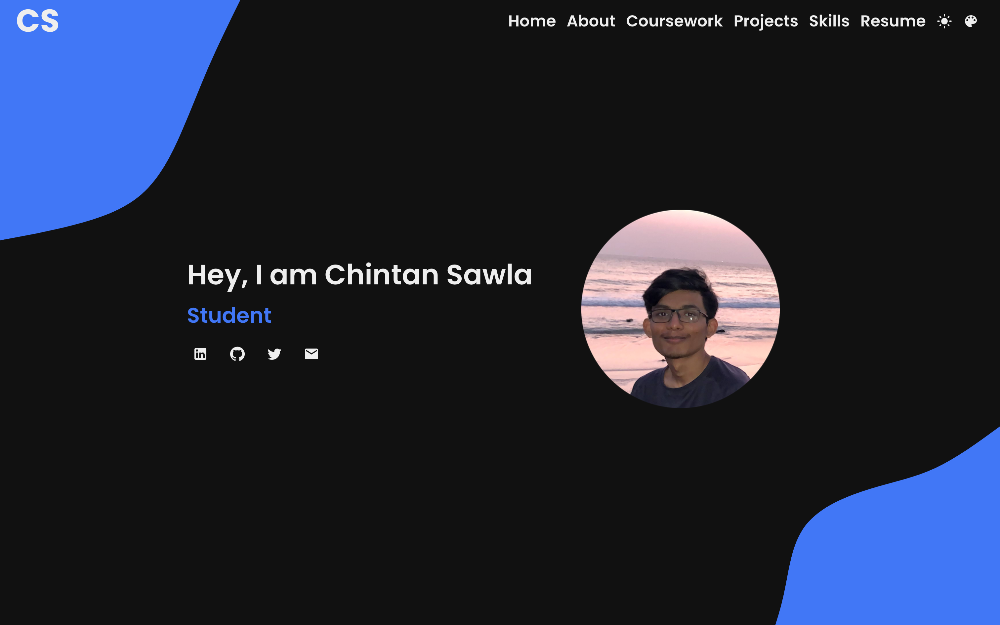
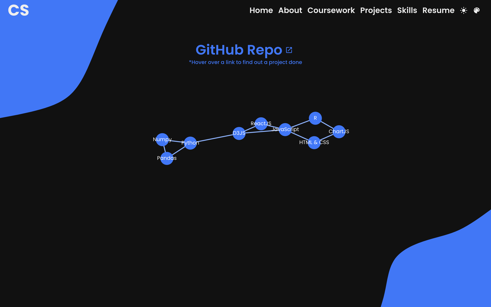

# Personal Website

The website intends to let people know about me and showcase my skills in design and code.

An important feature of the website is the [Skills](https://sawlachintan.github.io/personal-website/skills) page.

It demonstrates the languages and libraries I know, along with the applcations built with those tools. Each of the `nodes` are a language or a library, while the `links` are the applications built.

## Technical Features of the website

### Libaries used:

- D3JS
- Framer Motion
- Material UI
- ReactJS
- React Router
- TypewriterJS

### Tools used:

- VS Code
- Figma

## Future Objectives:

- Responsiveness to mobiles and tablets
- Enable high contrast
- Enable keyboard shortcuts
- Increase micro interactions
  - Change button color to accent on hover
  - Animate CS logo
