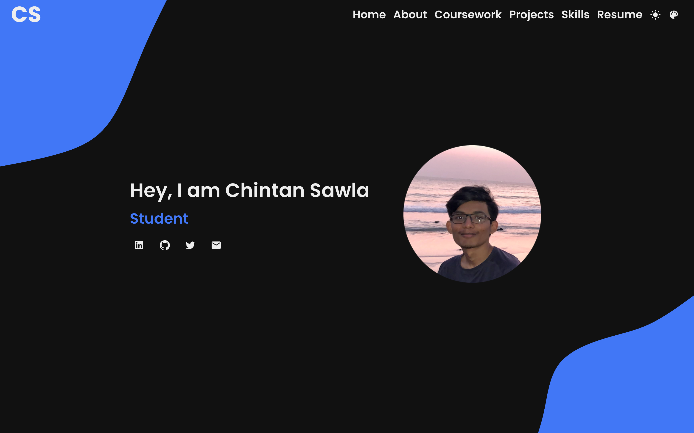

# Personal Website

The website intends to let people know about me and showcase my skills in design and code.

An important feature of the website is the [Skills](https://sawlachintan.github.io/personal-website/skills) page.

It demonstrates the languages and libraries I know, along with the applcations built with those tools. Each of the `nodes` are a language or a library, while the `links` are the applications built.

## Technical Features of the website

### Libaries used:

- [D3JS](https://d3js.org)
- [Framer Motion](https://www.framer.com/motion/)
- [Material UI](https://mui.com)
- [ReactJS](https://reactjs.org)
- [React Router](https://reactrouter.com)
- [TypewriterJS](https://github.com/tameemsafi/typewriterjs)

### Tools used:

- VS Code
- Figma

## References:
 - [Rafael Pedicini](https://github.com/rafgraph/spa-github-pages)
 - [FreeCodeCamp](https://www.youtube.com/channel/UC8butISFwT-Wl7EV0hUK0BQ)
 - 

## Future Objectives:

- Responsiveness to mobiles and tablets
- Enable high contrast
- Enable keyboard shortcuts
- Increase micro interactions
  - Change button color to accent on hover
  - Animate CS logo
